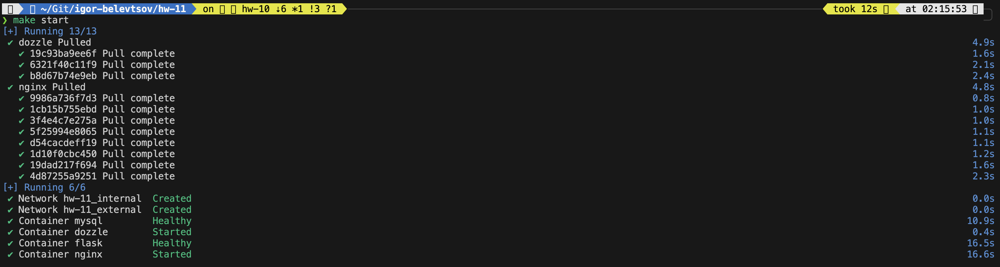
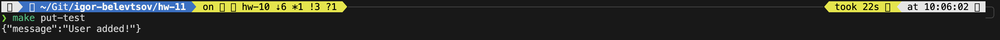
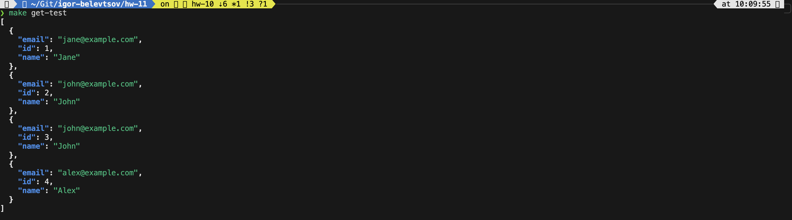
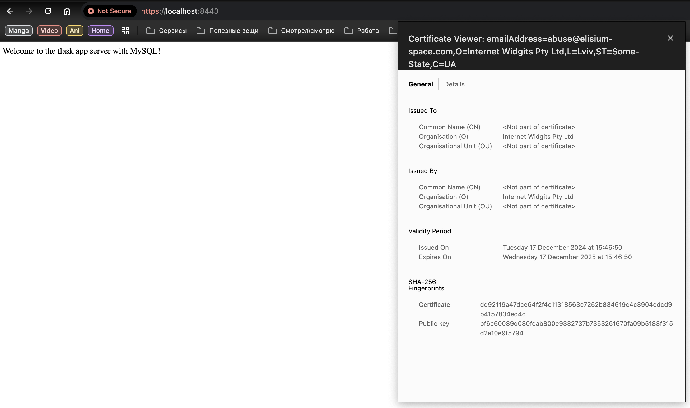
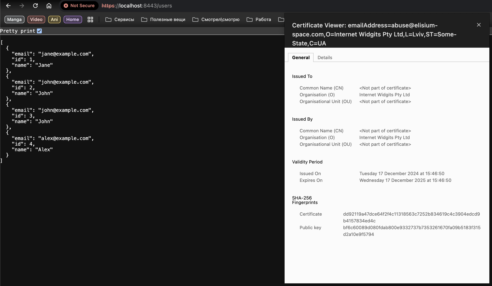
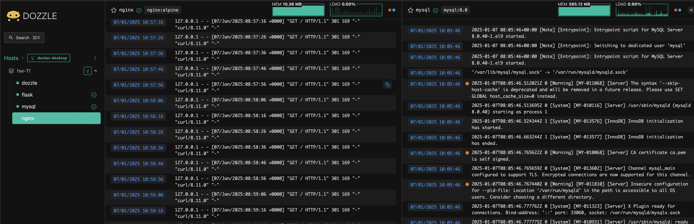

# HW-11 : Simple Docker Compose project 2

This guide sets up a Flask application with a MySQL database and Nginx reverse proxy using Docker Compose.

## Project Structure

```
./
├── app/                    # Python flask application configuration directory
|    ├── app.py             # Application
|    ├── requirements.txt   # Python modules requirements file
|    └── Dockerfile         # Dockerfile for building your own docker image
├── db/                     # MySQL database configuration directory
|   └── init.sql            # Initial script for database management
├── nginx/                  # Nginx configuration directory
|   ├── certs/              # SSL certificate directory
|   |    ├── server.crt     # SSL certificate
|   |    └── server.key     # SSL certificate key
|   └── default.conf        # Site configuration for our application
├── screenshots/            # Screenshot location directory
├── .env                    # Variable storage
├── docker-compose.yml      # Docker compose file
└── Makefile                # Makefile for better project management
```

## Steps

1. **Write Flask App (`app.py`)**
   - The app connects to MySQL and has routes for health-check and managing users.

2. **Write SQL Script for Database Initialization (`init.sql`)**
   - Creates the `flaskdb` , creates local MySQL users, add him permission to this database and a `users` table.

3. **Create `requirements.txt`**
   ```
   flask
   mysql-connector-python
   ```

4. **Create Dockerfile**

   <details>

   ```dockerfile
    FROM python:3.11-slim

    RUN apt update && \
        apt install -y curl && \
        apt clean

    WORKDIR /app

    ADD requirements.txt ./

    RUN pip install --no-cache-dir -r requirements.txt

    EXPOSE 5000

    HEALTHCHECK --interval=5s --timeout=5s --retries=3 CMD curl -f http://localhost:5000/health || exit 1

    CMD ["flask", "run", "--host=0.0.0.0", "--port=5000"]
   ```

   </details>

5. **Write Docker Compose Configuration (`docker-compose.yml`)**

   <details>

   ```yaml
    services:
    flask:
        image: ${APP_IMAGE_NAME}:${APP_IMAGE_TAG}
        container_name: flask
        networks:
        - internal
        volumes:
        - ./app/app.py:/app/app.py:ro
        environment:
        FLASK_ENV: development
        DB_HOST: mysql
        DB_USER: ${MYSQL_USER:-flask-app}
        DB_PASSWORD: ${MYSQL_PASSWORD:-flaskpassword}
        DB_NAME: ${MYSQL_DATABASE:-flaskdb}
        depends_on:
        mysql:
            condition: service_healthy
            restart: true

    mysql:
        image: ${DB_IMAGE_NAME}:${DB_IMAGE_TAG}
        container_name: mysql
        restart: always
        environment:
        MYSQL_ROOT_PASSWORD: ${MYSQL_ROOT_PASSWORD:-rootpassword}
        MYSQL_DATABASE: ${MYSQL_DATABASE:-flaskdb}
        MYSQL_USER: ${MYSQL_USER:-flask-app}
        MYSQL_PASSWORD: ${MYSQL_PASSWORD:-flaskpassword}
        networks:
        - internal
        volumes:
        - db_data:/var/lib/mysql
        - ./db/init.sql:/docker-entrypoint-initdb.d/init.sql
        healthcheck:
        test: ["CMD", "mysqladmin", "ping", "-h", "localhost"]
        interval: 10s
        timeout: 5s
        retries: 5

    nginx:
        image: nginx:alpine
        container_name: nginx
        networks:
        - external
        - internal
        ports:
        - "8443:443"
        - "8080:80"
        volumes:
        - ./nginx/default.conf:/etc/nginx/conf.d/default.conf:ro
        - ./nginx/certs:/etc/nginx/certs:ro
        depends_on:
        flask:
            condition: service_healthy
            restart: true
        healthcheck:
        test: ["CMD-SHELL", "curl -s http://localhost/ || exit 1"]
        interval: 10s
        timeout: 5s
        retries: 5

    dozzle:
        container_name: dozzle
        image: amir20/dozzle:latest
        networks:
        - external
        volumes:
        - /var/run/docker.sock:/var/run/docker.sock:ro
        ports:
        - 8888:8080
        restart: unless-stopped

    networks:
    internal:
    external:

    volumes:
    db_data:
   ```

   </details>

6. **Create Makefile for better project management**

   <details>

   ```makefile
    .PHONY: build push publish start restart stop clean ps logs put-test get-test

    -include .env

    CURRENT_ID := $(shell id -u)
    CURRENT_GROUP := $(shell id -g)
    CURRENT_DIR := $(shell pwd)
    JQ := $(shell command -v jq 2> /dev/null)

    D := CURRENT_USER=${CURRENT_ID}:${CURRENT_GROUP} docker
    DC := CURRENT_USER=${CURRENT_ID}:${CURRENT_GROUP} docker compose -p $(PROJECT_NAME)


    build:
        @$(D) build -f app/Dockerfile -t $(APP_IMAGE_NAME):$(APP_IMAGE_TAG) -t $(APP_IMAGE_NAME):latest app/

    push:
        @$(D) push $(APP_IMAGE_NAME):$(APP_IMAGE_TAG)
        @$(D) push $(APP_IMAGE_NAME):latest

    publish: build push

    start:
        @$(DC) up -d

    restart:
        @$(DC) restart

    stop:
        @$(DC) down

    clean:
        @$(DC) down --volumes --remove-orphans
        @$(D) rmi $(APP_IMAGE_NAME):$(APP_IMAGE_TAG)

    ps:
        @$(DC) ps

    logs:
        @$(DC) logs -f

    put-test:
        @curl -k -X POST -H "Content-Type: application/json" -d '{"name": "John", "email": "john@example.com"}' https://localhost:8443/users

    get-test:
    # ifndef JQ
    #     $(error "JQ is not installed. Please install jq tool from you package manager")
    # endif
        @curl -s -k https://localhost:8443/users | jq

   </details>

Makefile helps organize project deployment and testing workflow by using a short aliases instead of remembering long commands. You can use this commands:
  - build - build Docker image from Dockerfile;
  - push - push newly created Docker image to Dockerhub;
  - publish - combine two previous commands in one;
  - start - start Docker compose stack;
  - restart - restart Docker compose stack;
  - stop - stop Docker compose stack;
  - clean - cleanup all unused project resources;
  - ps - Docker ps;
  - logs - show Docker logs;
  - put-test - make put request to our application for adding a new reccord to MySQL database;
  - get-test - make get request to check if previous test passes and new record successfully added to database.

7. **Build and Run Containers**
   ```bash
   make publish
   make start
   ```

   <details>

   

   </details>

8. **Test the Flask App**
   - Add a User (POST):
     ```bash
     make put-test
     ```

     <details>

     

     </details>

   - Retrieve Users (GET):
     ```bash
     make get-test
     ```

     <details>

     

     </details>

     Web access example for SSL verification:

     <details>

     
     

     </details>

9. **Doozle container for testing and monitoring**

   Docker compose file includes one more specific service - `Doozle`. It communicate with local Docker socket and provides more user-friendly containers processes and log visibility.

   <details>

   

   </details>

## Notes

- MySQL database is initialized with the `init.sql` script.
- Flask app communicates with the MySQL container using the hostname `mysql`.
- Use Makefile for easy project management.
- All dynamic variables are stored in `.env` file and can be modified at any time for better usability.
