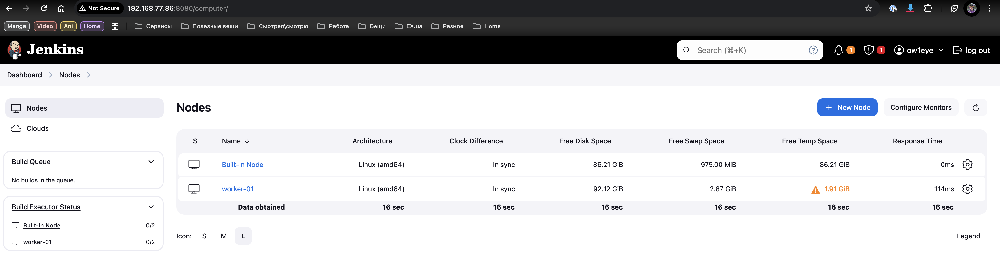
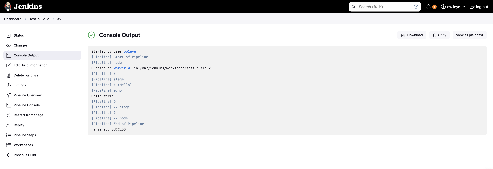

# HW-12 : Jenkins

## Installing Jenkins master node

*In my case I`m using Debian 12 for it.*
We will using official installation guide for Debian/Ubuntu distro:

```bash
sudo wget -O /usr/share/keyrings/jenkins-keyring.asc \
  https://pkg.jenkins.io/debian-stable/jenkins.io-2023.key
echo "deb [signed-by=/usr/share/keyrings/jenkins-keyring.asc]" \
  https://pkg.jenkins.io/debian-stable binary/ | sudo tee \
  /etc/apt/sources.list.d/jenkins.list > /dev/null
sudo apt-get update
sudo apt-get install jenkins
```

Now we need to install Java:

```bash
sudo apt update
sudo apt install fontconfig openjdk-17-jre
java -version
```

At this point we need to enable Jenkins service for autostart and then start Jenkins process:

```bash
sudo systemctl enable jenkins
sudo systemctl start jenkins
```

## Installing and connecting Jenkins slave node

*For this purpose I`m using Fedora Server.*

First we need to add new node from our Jenkins web console - you can find it by IP or hostname `http://ip-address:8080` if you are using default configuration. Login with admin account. Go to `Dashboard` > `Manage Jankins` > `Nodes` and click on `+ New Node` button in the right upper corner. On the next screen fill out `Name` and `Remote root directory` fields as they are required, other can be left blank.

Install Java as prerequisites for Jenkins agent:

```bash
dnf check-update
dnf install java-17-openjdk.x64_86
```

Next we need to create new user and working directory for Jenkins:

```bash
sudo useradd jenkins
sudo mkdir /var/jenkins
sudo chown jenkins:jenkins /var/jenkins
```

Now we can finaly download and run an agent:

```bash
su - jenkins # dont forget to switch to jenkins user
curl -sO http://192.168.77.86:8080/jnlpJars/agent.jar
java -jar agent.jar -url http://192.168.77.86:8080/ -secret nduqsbxnqkjxbqxnqjsknbchqpiuwh289ubxnsobvroqndnxo -name "worker-01" -webSocket -workDir "/var/jenkins"
```

Where:

 - `192.168.77.86` - Master-node hostname or IP-address;
 - `nduqsbxnqkjxb...` - auto-generated secret.

At this moment you can see that our newly created agent switch status to `Connected` in the web console.

 <details>

 

 </details>

 ## Create a test build with predefined pipeline script (Hello world)

 Create a new build by clicking on `New item` button. Fill out pipeline with preconfigured test script with name `Hello world`. Save it and then run build.

 If all correct you will see build logs as mentioned below.

 <details>

 

 </details>
