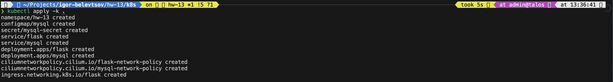

# HW-13 : k8s cluster application deployment

This guide will help you deploy a k8s cluster application that consist of frontend (flask) and backend (mysql).

## Project Structure

```
./
├── k8s/                            # Kubernetes manifests directory
|    ├── optional/                  # Optional manifests (under development)
|    |     └── ...
|    ├── flask-deployment.yaml      # Flask application deployment manifest
|    ├── flask-ingress.yaml         # Flask application ingress manifest
|    ├── flask-network-policy.yaml  # Flask application network policy manifest
|    ├── flask-service.yaml         # Flask application service manifest
|    ├── kustomization.yaml         # Kustomization manifest for managing the order in which configurations are applied
|    ├── mysql-configmap.yaml       # MySQL database config map manifest
|    ├── mysql-deployment.yaml      # MySQL database deployment manifest
|    ├── mysql-network-policy.yaml  # MySQL database network policy manifest
|    ├── mysql-service.yaml         # MySQL database service manifest
|    ├── namespace.yaml             # Project namespace manifest
|    └── secrets.yaml               # Project secrets manifest
├── screenshots/                    # Screenshot location directory
└── README.md                       # This file
```
*In this HW we will be using a Docker image created in previous task (HW-11) with slightly modified configuration for deployment in a Kubernetes cluster.*

**To achieve the correct sequence of applying manifests, we will use a kustomization manifest, since we need to create namespace and secrets first, then apply everything else.**

## Steps

1. **Apply kustomization manifest**
   ```bash
   cd k8s/
   kubectl apply -k .
   ```

   <details>

   
   </details>

2. **Check that all parts of project running**
   ```bash
   kubectl get all -o wide -n hw-13
   ```

   <details>

   
   </details>

3. **Create local port forwarding into flask pod**
   ```
   kubectl port-forward *pod_name* *host_port*:*pod_port*
   ```

4. **Check that flask app reachable and running**
   ```
   curl -s -k http://localhost:*port*/
   ```

   <details>

   
   </details>

5. **Make some POST request to our flask app that trigger writing to database**
   ```
   curl -k -X POST -H "Content-Type: application/json" -d '{"name": "Matthew", "email": "matthew@example.com"}' http://localhost:*port*/users
   curl -k -X POST -H "Content-Type: application/json" -d '{"name": "Allan", "email": "allan@example.com"}' http://localhost:*port*/users
   curl -k -X POST -H "Content-Type: application/json" -d '{"name": "John", "email": "john@example.com"}' http://localhost:*port*/users
   ```

   <details>

   
   </details>

6. **Check that flask app returning data from database**
   ```
   curl -s -k http://localhost:*port*/ | jq
   ```

   <details>

   
   </details>

## Notes

- This project used Cilium as CNI, ingress and network controller in our Kubernetes cluster instead of kube-proxy and Flannel.
- You can find here 'flask-configmap.yaml.off' file which optionaly can be used to deploy you some additional files inside flask container.
- Network policy that defined here allows strict separation of network traffic for our project.

    <details>

    **Flask network policy**
    

    **MySQL network policy**
    
    </details>
