# HW-3 : AWS VPC
## Configure AWS CLI
Before we start you need to get an AWS Key ID, AWS Secret Access Key pair in AWS web console.
Run configuration command:
```
aws configure
```
Enter AWS Key ID, AWS Secret Access Key, Default region name and Default output format. Now you are able to interact with AWS from shell. There is an example of configured CLI:

```
❯ aws configure
AWS Access Key ID [****************C5ST]:
AWS Secret Access Key [****************qb7r]:
Default region name [eu-north-1]:
Default output format [json]:
```
<details>

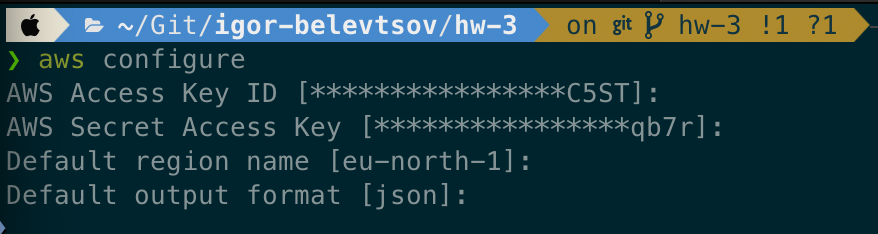
</details>

## List of all variables:

```
VPC_CIDR            # VPC CIDR IP address block
PUB_SUBNET_CIDR     # Public subnet CIDR IP address block
PRI_SUBNET_CIDR     # Private subnet CIDR IP address block
UBNT_AMI_ID         # Get last recently updated Ubuntu 22.04 LTS AMI ID owned by Canonical
VPC_ID              # VPC ID
PUB_SUBNET_ID       # Public subnet ID
PRI_SUBNET_ID       # Private subnet ID
IGW_ID              # Internet Gateway ID
PUB_RT_ID           # Public route table ID
PRI_RT_ID           # Private route table ID
FRONT_SG_ID         # Frontend security group ID
BACK_SG_ID          # Backend security group ID
FRONT_INSTANCE_ID   # Frontend EC2 instance ID
BACK_INSTANCE_ID    # Backend EC2 instance ID
FRONT_PRIVATE_IP    # Frontend EC2 instance private IP address
FRONT_PUBLIC_IP     # Frontend EC2 instance public IP address
BACK_PRIVATE_IP     # Backend EC2 instance private IP address
```

## Create new VPC
Before we start lets define some variables:

```
VPC_CIDR="192.168.0.0/24"
PUB_SUBNET_CIDR="192.168.0.0/25"
PRI_SUBNET_CIDR="192.168.0.128/25"
UBNT_AMI_ID=$(aws ec2 describe-images --owners 099720109477 --filters "Name=name,Values=ubuntu/images/hvm-ssd/ubuntu*22.04-amd64-server-*" "Name=architecture,Values=x86_64" --query 'sort_by(Images, &CreationDate)[-1].[ImageId]' --output text)
```
<details>

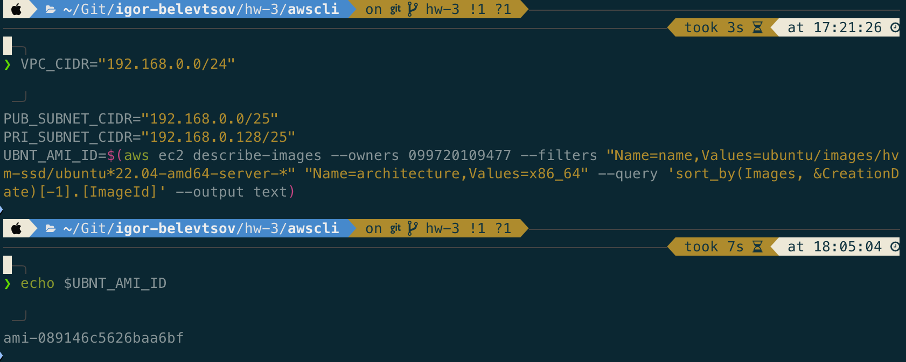
</details>

This command will create a new VPC with defined CIDR IP address block and save it 'VpcId' value as variable for future use with name tag:

```
VPC_ID=$(aws ec2 create-vpc --cidr-block $VPC_CIDR --query 'Vpc.VpcId' --output text)
aws ec2 create-tags --resources $VPC_ID --tags Key=Name,Value=HW3-VPC
```
<details>

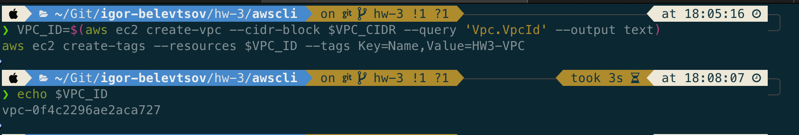
</details>

Check that VPC created successfully:

```
aws ec2 describe-vpcs --vpc-ids $VPC_ID
```
<details>

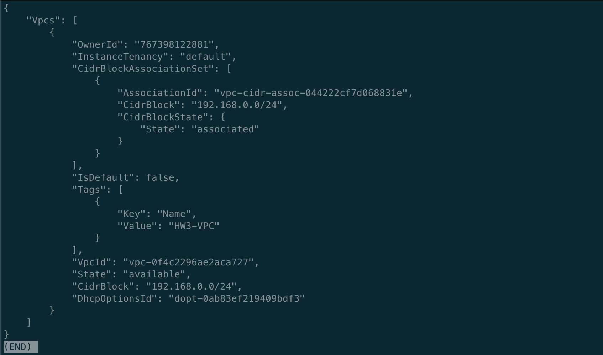
</details>

## Create public and private subnets:
Create public subnet and save it 'SubnetId' value as variable for future use with name tag:

```
PUB_SUBNET_ID=$(aws ec2 create-subnet --vpc-id $VPC_ID --cidr-block $PUB_SUBNET_CIDR --query 'Subnet.SubnetId' --output text)
aws ec2 create-tags --resources $PUB_SUBNET_ID --tags Key=Name,Value=publicSubnet
```
<details>

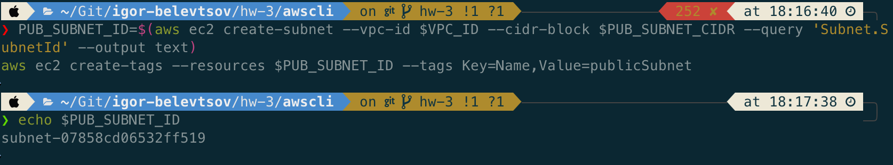
</details>

Create private subnet and save it 'SubnetId' value as variable for future use with name tag:
```
PRI_SUBNET_ID=$(aws ec2 create-subnet --vpc-id $VPC_ID --cidr-block $PRI_SUBNET_CIDR --query 'Subnet.SubnetId' --output text)
aws ec2 create-tags --resources $PRI_SUBNET_ID --tags Key=Name,Value=privateSubnet
```
<details>

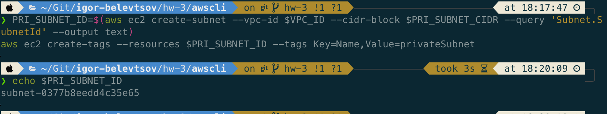
</details>

## Create internet gateway and save it 'InternetGatewayId' value as variable for future use with name tag:

```
IGW_ID=$(aws ec2 create-internet-gateway --query 'InternetGateway.InternetGatewayId' --output text)
aws ec2 create-tags --resources $IGW_ID --tags Key=Name,Value=HW3-IGW
```
<details>

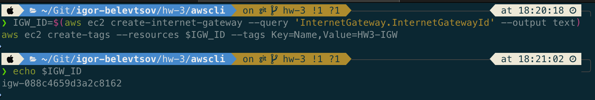
</details>

Attach internet gateway to our VPC:

```
aws ec2 attach-internet-gateway --internet-gateway-id $IGW_ID --vpc-id $VPC_ID
```

## Create routing table for each subnets:
Create public subnet routing table and save it 'RouteTableId' value as variable for future use with name tag:

```
PUB_RT_ID=$(aws ec2 create-route-table --vpc-id $VPC_ID --query 'RouteTable.RouteTableId' --output text)
aws ec2 create-tags --resources $PUB_RT_ID --tags Key=Name,Value=rtPublic
```
<details>

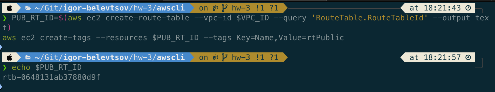
</details>

Create private subnet routing table and save it 'RouteTableId' value as variable for future use with name tag:

```
PRI_RT_ID=$(aws ec2 create-route-table --vpc-id $VPC_ID --query 'RouteTable.RouteTableId' --output text)
aws ec2 create-tags --resources $PRI_RT_ID --tags Key=Name,Value=rtPrivate
```
<details>

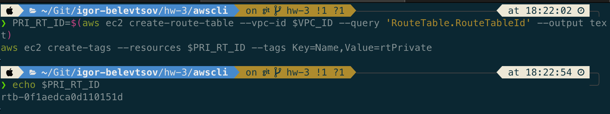
</details>

## Create routes:
## Create routes for public routing table and associate it with corresponding subnet:

```
aws ec2 create-route --route-table-id $PUB_RT_ID --destination-cidr-block 0.0.0.0/0 --gateway-id $IGW_ID
aws ec2 associate-route-table --route-table-id $PUB_RT_ID --subnet-id $PUB_SUBNET_ID
```
<details>

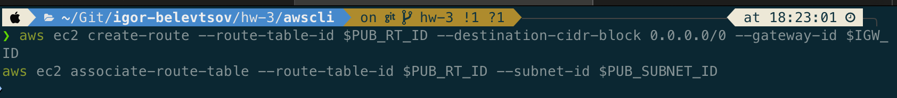
</details>

## Create a security groups for VPC:
Create a security group for our front-end subnet:
Allow SSH from anywhere and save it 'GroupId' value as variable for future use alongside add description with name tag:

```
FRONT_SG_ID=$(aws ec2 create-security-group --group-name allow-ssh --description "Security group that allows SSH connection to public subnet instances" --vpc-id $VPC_ID --query 'GroupId' --output text)
aws ec2 create-tags --resources $FRONT_SG_ID --tags Key=Name,Value=sg-FRONT
aws ec2 authorize-security-group-ingress --group-id $FRONT_SG_ID --protocol tcp --port 22 --cidr 0.0.0.0/0
```
<details>

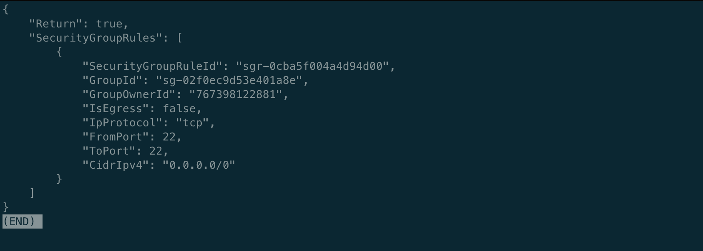
</details>

Create a security group for out back-end subnet:
Full internal access between our public and private subnets and save it 'GroupId' value as variable for future use alongside add description with name tag:

```
BACK_SG_ID=$(aws ec2 create-security-group --group-name allow-intranet --description "Security group that allows full access between internal VPC instances" --vpc-id $VPC_ID --query 'GroupId' --output text)
aws ec2 create-tags --resources $BACK_SG_ID --tags Key=Name,Value=sg-BACK
aws ec2 authorize-security-group-ingress --group-id $BACK_SG_ID --protocol all --port all --source-group $FRONT_SG_ID
```
<details>

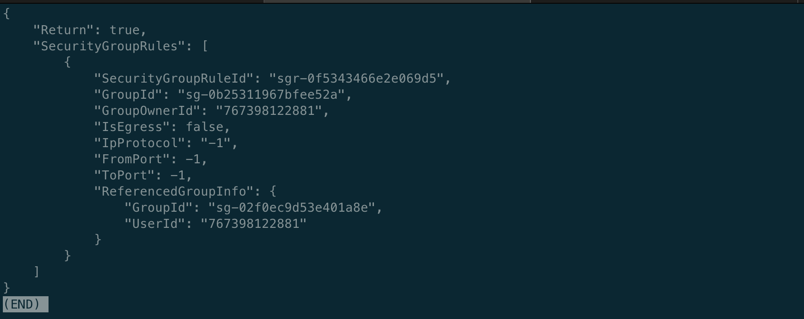
</details>

## Create an EC2 instances in our VPC:
First we need to create a key-pair for our instances and verify it:

```
aws ec2 create-key-pair --key-name blackbird --query 'KeyMaterial' --output text > blackbird.pem
aws ec2 describe-key-pairs --key-name blackbird
```
Create a frontend instance in public subnet with name tag and print host public and private IP address:

```
FRONT_INSTANCE_ID=$(aws ec2 run-instances --image-id $UBNT_AMI_ID --count 1 --instance-type t3.micro --key-name blackbird --security-group-ids $FRONT_SG_ID --subnet-id $PUB_SUBNET_ID --associate-public-ip-address --query 'Instances[0].InstanceId' --output text)
aws ec2 create-tags --resources $FRONT_INSTANCE_ID --tags Key=Name,Value=HW3-Frontend
aws ec2 wait instance-running --instance-ids $FRONT_INSTANCE_ID
FRONT_PRIVATE_IP=$(aws ec2 describe-instances --instance-ids $FRONT_INSTANCE_ID --query 'Reservations[0].Instances[0].PrivateIpAddress' --output text)
FRONT_PUBLIC_IP=$(aws ec2 describe-instances --instance-ids $FRONT_INSTANCE_ID --query 'Reservations[0].Instances[0].PublicIpAddress' --output text)
echo "Frontend instance $FRONT_INSTANCE_ID has private IP: $FRONT_PRIVATE_IP and public IP: $FRONT_PUBLIC_IP"
```
<details>

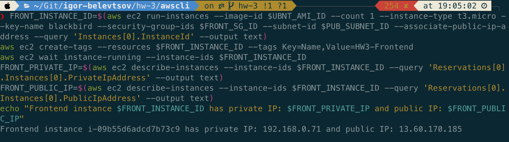
</details>

Create a backend instance in private subnet with name tag and print host private IP address:

```
BACK_INSTANCE_ID=$(aws ec2 run-instances --image-id $UBNT_AMI_ID --count 1 --instance-type t3.micro --key-name blackbird --security-group-ids $BACK_SG_ID --subnet-id $PRI_SUBNET_ID --query 'Instances[0].InstanceId' --output text)
aws ec2 create-tags --resources $BACK_INSTANCE_ID --tags Key=Name,Value=HW3-Backend
aws ec2 wait instance-running --instance-ids $BACK_INSTANCE_ID
BACK_PRIVATE_IP=$(aws ec2 describe-instances --instance-ids $BACK_INSTANCE_ID --query 'Reservations[0].Instances[0].PrivateIpAddress' --output text)
echo "Backend instance $BACK_INSTANCE_ID has private IP: $BACK_PRIVATE_IP"
```
<details>

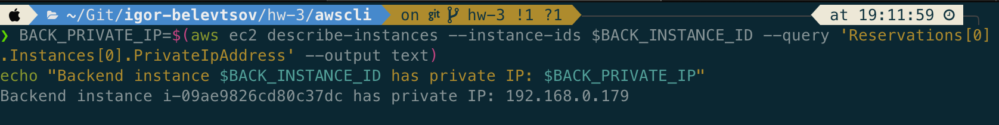
</details>

## Frontend instance SSH jump-host configuration command:

```
ssh -J ubuntu@$FRONT_PUBLIC_IP ubuntu@$BACK_PRIVATE_IP
```

## Create an alias for easier ssh access:

```
export ssh_dbhost='ssh -i blackbird.pem -J ubuntu@$FRONT_PUBLIC_IP ubuntu@$BACK_PRIVATE_IP'
source ~/.profile
ssh_dbhost
```
