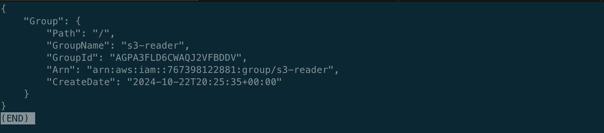
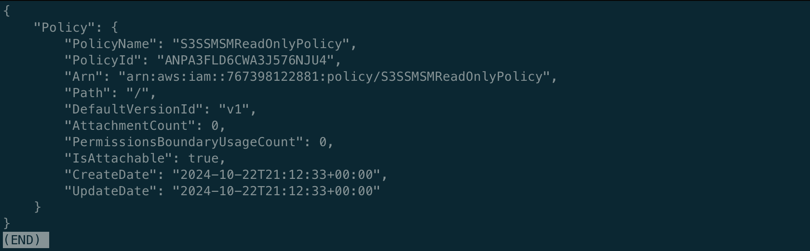
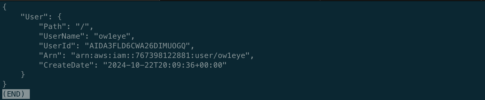
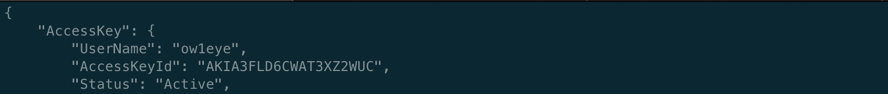

# AWS IAM
## Step 1: Create a group and add custom S3/SSM/SM read-only permissions:
### Create 's3-reader' group:

```
aws iam create-group --group-name s3-reader
```
<details>


</details>

### Create 's3-ssm-sm-readonly-policy.json' file with next content:

```
{
    "Version": "2012-10-17",
    "Statement": [
        {
            "Effect": "Allow",
            "Action": [
                "s3:GetObject",
                "s3:ListBucket"
            ],
            "Resource": [
                "arn:aws:s3:::homelab",
                "arn:aws:s3:::homelab/*"
            ]
        },
        {
            "Effect": "Allow",
            "Action": [
                "ssm:GetParameter",
                "ssm:GetParameters",
                "ssm:DescribeParameters"
            ],
            "Resource": "arn:aws:ssm:*:*:parameter/*"
        },
        {
            "Effect": "Allow",
            "Action": [
                "ssm:StartSession",
                "ssm:DescribeSessions",
                "ssm:ResumeSession",
                "ssm:TerminateSession"
            ],
            "Resource": "arn:aws:ec2:*:*:instance/*"
        },
        {
            "Effect": "Allow",
            "Action": [
                "ssm:GetConnectionStatus"
            ],
            "Resource": "*"
        },
        {
            "Effect": "Allow",
            "Action": [
                "ssmmessages:CreateControlChannel",
                "ssmmessages:CreateDataChannel",
                "ssmmessages:OpenControlChannel",
                "ssmmessages:OpenDataChannel"
            ],
            "Resource": "*"
        },
        {
            "Effect": "Allow",
            "Action": [
                "s3:GetEncryptionConfiguration"
            ],
            "Resource": "*"
        },
        {
            "Effect": "Allow",
            "Action": [
                "kms:Decrypt"
            ],
            "Resource": "key-name"
        }
    ]
}
```

### Create an IAM custom policy based on provided above access parameters:

```
aws iam create-policy --policy-name S3SSMSMReadOnlyPolicy --policy-document file://s3-ssm-sm-readonly-policy.json
aws iam attach-group-policy --group-name s3-reader --policy-arn arn:aws:iam::767398122881:policy/S3SSMSMReadOnlyPolicy
```
<details>


</details>

### Create the IAM role for EC2 with SSM access:

```
aws iam create-role --role-name SSMRole --assume-role-policy-document '{
    "Version": "2012-10-17",
    "Statement": {
        "Effect": "Allow",
        "Principal": {
            "Service": "ec2.amazonaws.com"
        },
        "Action": "sts:AssumeRole"
    }
}'
```

<details>


</details>

### Attach the AmazonSSMManagedInstanceCore policy to the role:

```
aws iam attach-role-policy --role-name SSMRole --policy-arn arn:aws:iam::aws:policy/AmazonSSMManagedInstanceCore
aws iam attach-role-policy --role-name SSMRole --policy-arn arn:aws:iam::767398122881:policy/S3SSMSMReadOnlyPolicy
```

### Launch an EC2 instance with the role and instance profile attached:

```
INSTANCE_ID=$(aws ec2 run-instances \
    --image-id $UBNT_AMI_ID \
    --count 1 \
    --instance-type t3.micro \
    --key-name blackbird \
    --security-group-ids $FRONT_SG_ID \
    --subnet-id $PUB_SUBNET_ID \
    --iam-instance-profile Name=SSMRole \
    --tag-specifications 'ResourceType=instance,Tags=[{Key=Name,Value=ec2-iam-test}]' \
    --query 'Instances[0].InstanceId' \
    --output text)
echo "Created EC2 instance with ID: $INSTANCE_ID"
```

### Ensure the EC2 Instance is Ready for Session Manager:

```
aws ssm describe-instance-information
```

### Start a Session Using Session Manager:

```
aws ssm start-session --target $INSTANCE_ID
```

### (Optional) You can list the attached policies for the 's3-reader' group to confirm everything is set up correctly:

```
aws iam list-attached-group-policies --group-name s3-reader
```
<details>


</details>

## Step 2: Create an 'ow1eye' user and add it to the 's3-reader' group:

```
aws iam create-user --user-name ow1eye
```
<details>


</details>

```
aws iam add-user-to-group --user-name ow1eye --group-name s3-reader
```

## (Optional) Step 3: Create access keys for the user 'ow1eye':

```
aws iam create-access-key --user-name ow1eye
```
<details>


</details>
