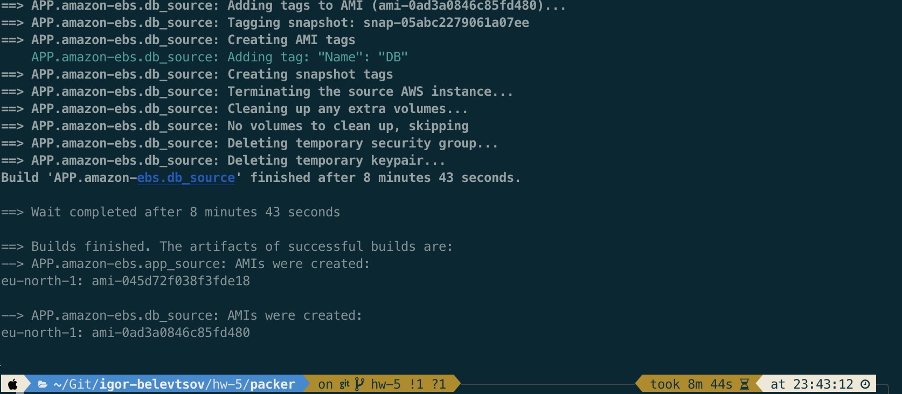
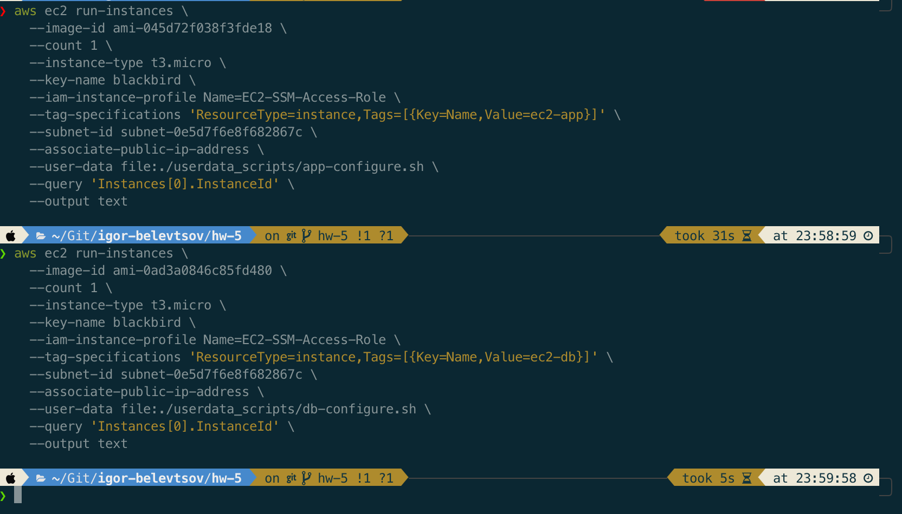

# HW-5 : AWS AMI with Packer

***You can find a separate manuals for each part of HW in their respective directories***

## Folder Structure

```
.
├── app_service         # Systemd application service configuration
├── db_backup           # Database backup script
├── packer              # Packer configuration for project AMI`s
└── usedata_scripts     # Userdata configuration scripts for EC2 instance provisioning
```

## There is a single script in project root directory that named **launch-project.sh** to summarize few separated part in one place:
Script content:

<details>

```bash
#!/bin/sh
# Build AMI's using Packer:
# APP
packer build -var-file=variables.pkr.hcl app.pkr.hcl | sudo tee app_ami_output.txt
$APP_AMI_ID=$(tail -2 app_ami_output.txt | head -2 | awk 'match($0, /ami-.*/) { print substr($0, RSTART, RLENGTH) }')
# DB
packer build -var-file=variables.pkr.hcl db.pkr.hcl | sudo tee db_ami_output.txt
$DB_AMI_ID=$(tail -2 db_ami_output.txt | head -2 | awk 'match($0, /ami-.*/) { print substr($0, RSTART, RLENGTH) }')

# Launch EC2 instances using AMI's from previous step:
# APP
$APP_INSTANCE_ID=$(aws ec2 run-instances \
    --image-id $APP_AMI_ID \
    --count 1 \
    --instance-type t3.micro \
    --key-name blackbird \
    --iam-instance-profile Name=EC2-SSM-Access-Role \
    --tag-specifications 'ResourceType=instance,Tags=[{Key=Name,Value=ec2-app}]' \
    --subnet-id subnet-0e5d7f6e8f682867c \
    --associate-public-ip-address \
    --user-data file:./userdata_scripts/app-configure.sh \
    --query 'Instances[0].InstanceId' \
    --output text)
aws ec2 create-tags --resources $APP_INSTANCE_ID --tags Key=Name,Value=HW5-APP
aws ec2 wait instance-running --instance-ids $APP_INSTANCE_ID
# DB
$DB_INSTANCE_ID=$(aws ec2 run-instances \
    --image-id $DB_AMI_ID \
    --count 1 \
    --instance-type t3.micro \
    --key-name blackbird \
    --iam-instance-profile Name=EC2-SSM-Access-Role \
    --tag-specifications 'ResourceType=instance,Tags=[{Key=Name,Value=ec2-db}]' \
    --subnet-id subnet-0e5d7f6e8f682867c \
    --associate-public-ip-address \
    --user-data file:./userdata_scripts/db-configure.sh \
    --query 'Instances[0].InstanceId' \
    --output text)
aws ec2 create-tags --resources $DB_INSTANCE_ID --tags Key=Name,Value=HW5-DB
aws ec2 wait instance-running --instance-ids $DB_INSTANCE_ID
```
</details>

AMI's creation process

<details>



</details>

EC2 instance launching process:

<details>



</details>

## This script will do next:

- create an App and DB AMI's with Packer;
- launch EC2 instances with newly created App and DB AMI's and run AWS CLI userdata provisioners as system preconfiguration.
