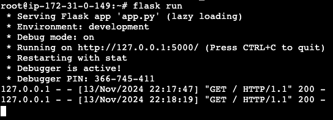
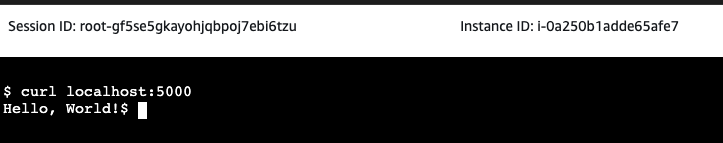

# Setting Up Systemd Service for Flask Application on APP Instance

This guide provides instructions to set up a systemd service for running the Flask application on the APP AMI instance. The service will start automatically on boot and can be managed using systemd commands.

## Steps to Set Up the Service

1. **Create the service file**: Save the following configuration as `/etc/systemd/system/flask-app.service`.

<details>

   ```ini
   [Unit]
   Description=Flask Application Service
   After=network.target

   [Service]
   User=ubuntu  # Replace with the user under which you want to run the app
   WorkingDirectory=/opt/flask-alb-app  # Path to the application directory
   ExecStart=/usr/bin/python3 /opt/flask-alb-app/app.py  # Command to start the app

   # Environment variables (optional)
   Environment="FLASK_APP=/opt/flask-alb-app/app.py"
   Environment="FLASK_ENV=production"
   Environment="DB_HOST=DB_AMI_IP_OR_DNS" # Replace `DB_AMI_IP_OR_DNS` with the private IP or DNS of the DB instance in production.
   Environment="DB_USER=$(aws ssm get-parameter --name "/app/DB_USER" --with-decryption --query "Parameter.Value" --output text)"
   Environment="DB_PASSWORD=$(aws ssm get-parameter --name "/app/DB_USER_PASS" --with-decryption --query "Parameter.Value" --output text)"  # Set actual credentials

   Restart=always
   RestartSec=5

   [Install]
   WantedBy=multi-user.target
   ```
   </details>

- User: Set this to the user who should run the application (e.g., ubuntu).
- WorkingDirectory: Path to your application’s root directory.
- ExecStart: Path to the Python interpreter and the application’s main file (app.py).
- Environment: Include any environment variables needed by the application, like database connection details.

2.	**Enable and Start the Service:**

<details>

```bash
sudo systemctl daemon-reload
sudo systemctl enable flask-app.service
sudo systemctl start flask-app.service
```
</details>

3.	**Check the Service Status::**

<details>

```bash
sudo systemctl status flask-app.service
```
</details>

4. **Check web server status with curl:**

<details>




</details>

## Explanation

This systemd service configuration will:

- Start the application automatically on boot.
- Restart the application on failure.
- Use the specified environment variables and application directory paths.

## Notes

- Adjust paths and environment variables as needed to match your application’s configuration.
