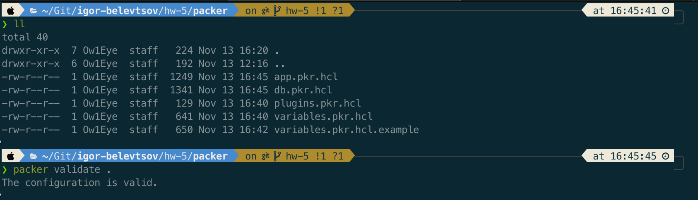

# Packer Configuration for AWS AMIs: APP and DB

This repository contains Packer configurations to create two AWS AMIs based on Ubuntu 22.04:

1. **APP AMI**: Pre-installed with Flask and other dependencies to run a GitHub-hosted Flask application.
2. **DB AMI**: Pre-installed and configured with MySQL to serve as the database for the APP AMI.

## Prerequisites

- [Packer](https://www.packer.io/) installed on your local machine.
- AWS credentials configured in your environment to allow AMI creation.

## Folder Structure

```
.
├── screenshots/                # screenshots storage directory
├── app.pkr.hcl                 # Packer config for the APP AMI
├── db.pkr.hcl                  # Packer config for the DB AMI
├── plugins.pkr.hcl             # Packer plugin prerequisites
└── variables.pkr.hcl.example   # Common variables example
```

## Configuration Files

### `plugins.pkr.hcl`

This file contains plugins prerequisites for this project. Update the values as needed.

<details>

```hcl
packer {
  required_plugins {
    amazon = {
      version = ">= 1.3.3"
      source  = "github.com/hashicorp/amazon"
    }
  }
}
```
</details>

### `variables.pkr.hcl`

This file contains the variables used across both configurations. Update the values as needed.

<details>

```hcl
variable "aws_region" {
  type    = string
  default = "eu-north-1"
}

variable "instance_type" {
  type    = string
  default = "t3.micro"
}

variable "subnet_id" {
  type    = string
  default = "subnet-somenumber"
}

variable "vpc_id" {
  type    = string
  default = "vpc-somenumber"
}

variable "source_ami" {
  type    = string
  default = "ami-089146c5626baa6bf"  # For manual usage only! Update with Ubuntu 22.04 AMI ID in your AWS region by executing next commands without quotes "aws ec2 describe-images --owners 099720109477 --filters "Name=name,Values=ubuntu/images/hvm-ssd/ubuntu*22.04-amd64-server-*" "Name=architecture,Values=x86_64" --query 'sort_by(Images, &CreationDate)[-1].[ImageId]' --output text"
}
```
</details>

### `app.pkr.hcl`

This file configures the APP AMI, which includes:

1. Installing `python3-pip` and `flask`.
2. Configuring some system settings.

<details>

```hcl
source "amazon-ebs" "app_source" {
  ami_name             = "APP_AMI_{{timestamp}}"
  instance_type        = var.instance_type
  region               = var.aws_region
  subnet_id            = var.subnet_id
  vpc_id               = var.vpc_id
  ssh_username         = "ubuntu"
  ssh_interface        = "session_manager"
  communicator         = "ssh"
  iam_instance_profile = "EC2-SSM-Access-Role" # This role was used in previous HW and already have configured SSM and S3 permission for instance
  source_ami_filter {
    filters = {
      virtualization-type = "hvm"
      name                = "ubuntu/images/hvm-ssd/ubuntu*22.04-amd64-server-*"
      root-device-type    = "ebs"
    }
    owners      = ["099720109477"]
    most_recent = true
  }

  tags = {
    Name = "APP"
  }
}

build {
  name = "APP"
  sources = [
    "source.amazon-ebs.app_source"
  ]

  provisioner "shell" {
    inline = [
      "sudo apt update",
      "sudo apt install -y python3-pip",
      "pip3 install flask",
      "sudo mkdir /opt/flask-alb-app",
      "export PATH="/home/ubuntu/.local/bin:$PATH""
    ]
  }
}
```
</details>

### `db.pkr.hcl`

This file configures the DB AMI, which includes:

1. Installing MySQL.
2. Preparing DB.

<details>

```hcl
source "amazon-ebs" "db_source" {
  ami_name      = "DB_AMI_{{timestamp}}"
  instance_type = var.instance_type
  region        = var.aws_region
  subnet_id     = var.subnet_id
  vpc_id        = var.vpc_id
  ssh_username  = "ubuntu"
  ssh_interface        = "session_manager"
  communicator         = "ssh"
  iam_instance_profile = "EC2-SSM-Access-Role"  # This role was used in previous HW and already have configured SSM and S3 permission for instance
  source_ami_filter {
    filters = {
      virtualization-type = "hvm"
      name                = "ubuntu/images/hvm-ssd/ubuntu*22.04-amd64-server-*"
      root-device-type    = "ebs"
    }
    owners      = ["099720109477"]
    most_recent = true
  }

  tags = {
    Name = "DB"
  }
}

build {
  name = "APP"
  sources = [
    "source.amazon-ebs.db_source"
  ]

  provisioner "shell" {
    inline = [
      "sudo apt update",
      "sudo apt install -y mysql-server",
      # Configure MySQL to listen on all interfaces
      "sudo sed -i 's/^bind-address.*/bind-address = 0.0.0.0/' /etc/mysql/mysql.conf.d/mysqld.cnf",
      "sudo systemctl restart mysql",
      "sudo systemctl enable mysql"
    ]
  }
}
```
</details>

## Usage Instructions

1. First, validate your Packer templates to ensure they are properly configured:

   ```bash
   packer validate .
   ```

   <details>

   
   </details>

2. Build the APP AMI:

   ```bash
   packer build -var-file=variables.pkr.hcl app.pkr.hcl
   ```

3. Build the DB AMI:

   ```bash
   packer build -var-file=variables.pkr.hcl db.pkr.hcl
   ```

## Notes

- Replace `DB_AMI_IP_OR_DNS` in `app.pkr.hcl` with the private IP or DNS of the DB instance in production.
- Adjust database credentials as needed for production security.
