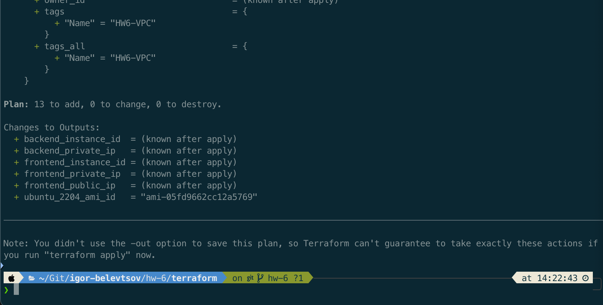
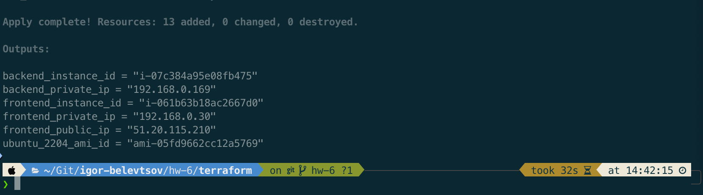
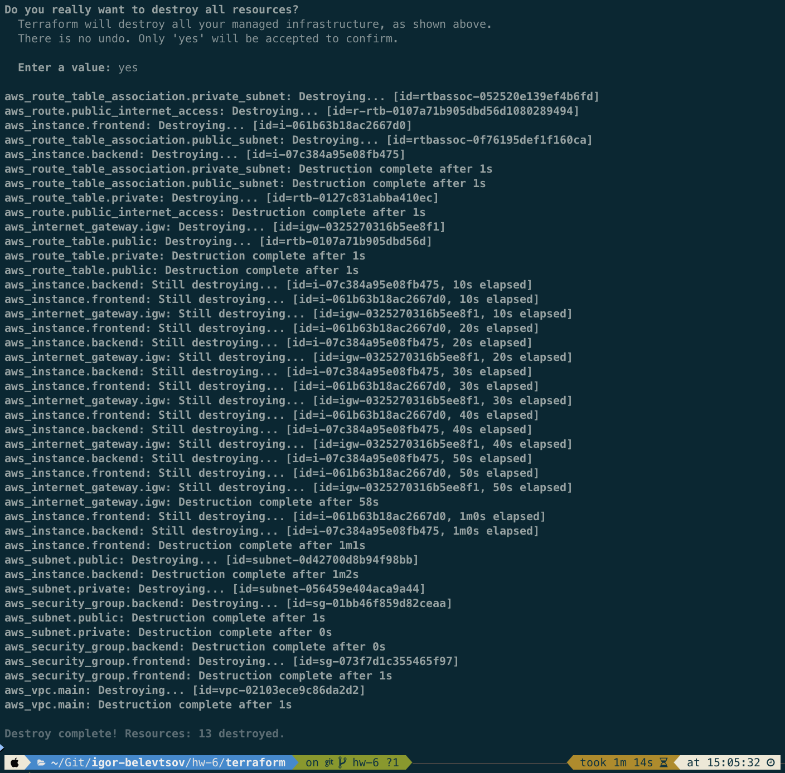

# HW-6 : Basic insfrastructure with Terraform

## Folder Structure

```
./terraform/
├── aws-frontend-userdata.sh    # Userdata script with basic system configuration for AWS EC2 frontend instance
├── instances-main.tf           # AWS EC2 instances configuration
├── instances-variables.tf      # AWS EC2 instances variables
├── instances-output.tf         # AWS EC2 instances output information configuration
├── network-main.tf             # AWS VPC network configuration
├── network-variables.tf        # AWS VPC network variables
├── providers-main.tf           # Terraform providers configuration
├── sg-main.tf                  # AWS security group configuration
└── ubuntu-latest-ami.tf        # Getting Ubuntu 22.04 latest AMI ID

```

### As part of our project we are going to do next thing here using Terraform:

- Creating a AWS VPC with definned CIDR block 192.168.0.0/24.
- Creating a two separate networks under VPC for private and public access.
- Creating a routing tables for this networks.
- Creating a different security groups that allow ssh only for public network and full access between VPC instances for private network.
- Creating a two AWS EC2 instances with defined parameters and running provisioner for frontend one.

## Prerequisites:

- [***Terraform***](https://developer.hashicorp.com/terraform/install?product_intent=terraform)
- [***AWS CLI***](https://aws.amazon.com/cli/)

1. **Clone this repository:**

```bash
git clone https://github.com/DevOps-Pro-24-09-24/igor-belevtsov.git -b hw-6
```

2. **Navigate to Terraform directory:**

```bash
cd terraform/
```

3. **Run next commands to initialize and plan Terraform:**

```bash
terraform init
terraform plan
```

Check output for planing job.
<details>


</details>

4. **Now we can let Terraform create an infrastructure for us:**

```bash
terraform apply
```

Check output for results.
<details>


</details>

## Notes:

If you dont need this structure anymore run a destroy process with Terraform:

```bash
terraform destroy
```
<details>



</details>
