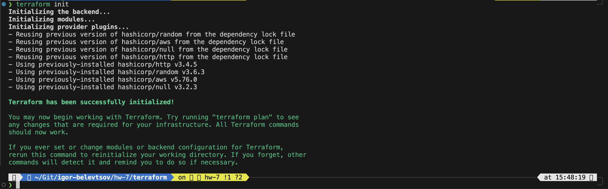
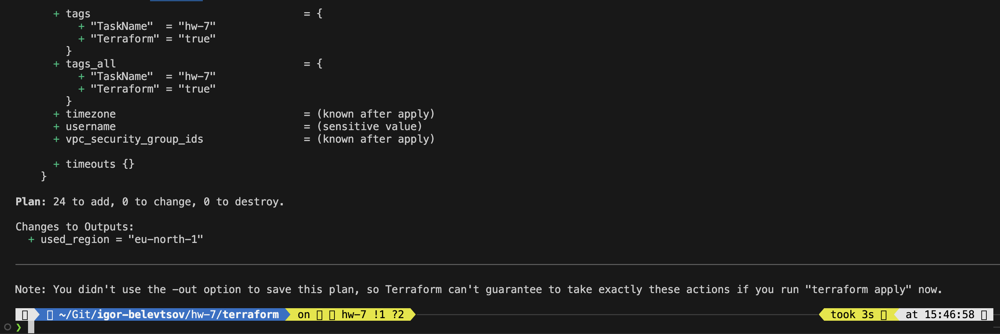
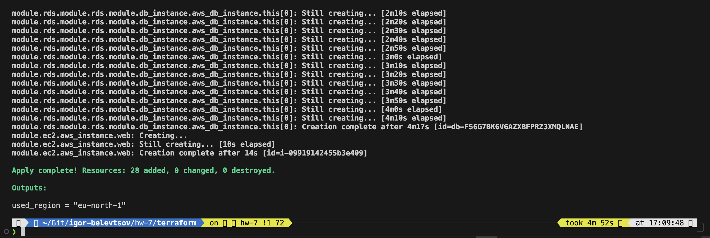

# HW-7 : Basic Terraform insfrastructure with RDS

## Folder Structure

```
./terraform/
├── modules    # Userdata script with basic system configuration for AWS EC2 frontend instance
|      ├── ec2
|      |    ├── main.tf             # AWS EC2 module main configuration
|      |    ├── variables.tf        # AWS EC2 module variables
|      |    └── outputs.tf          # AWS EC2 module outputs
|      ├── rds
|      |    ├── main.tf             # AWS RDS module main configuration
|      |    ├── variables.tf        # AWS RDS module variables
|      |    └── outputs.tf          # AWS RDS module outputs
|      ├── security_group
|      |    ├── main.tf             # AWS security group module main configuration
|      |    ├── variables.tf        # AWS security group module variables
|      |    └── outputs.tf          # AWS security group module outputs
|      └── vpc
|           ├── main.tf             # AWS VPC module main configuration
|           ├── variables.tf        # AWS VPC module variables
|           └── outputs.tf          # AWS VPC module outputs
├── main.tf                         # Project Terraform main configuration
├── outputs.tf                      # Project Terraform outputs configuration
└── variables.tf                    # Project Terraform variables configuration
```

### As part of our project we are going to do next thing here using Terraform:

- Creating AWS VPC with definned CIDR block 192.168.0.0/24.
- Creating two separate networks under VPC for private and public access.
- Creating routing tables for this networks.
- Creating different security groups that allow ssh/http/https access for public network and full access between VPC instances for private network.
- Creating AWS EC2 instance with defined parameters and running provisioner for it.
- Creating AWS RDS database for Wordpress web application hosted on EC2 instance from prevous section.

### Main code has been separated for core and modules usage. It consist of:

AWS VPC module;
AWS Security Group module;
AWS RDS module;
AWS EC2 module.

They provides AWS resourse creation based on their names.

### Initialize Terraform:

```
terraform init
```

<details>


</details>

### Preview the deployment plan:

```
terraform plan
```

<details>


</details>

### Apply changes:

```
terraform apply
```

<details>


</details>

### Verify that all resources were successfully created in the AWS console.
