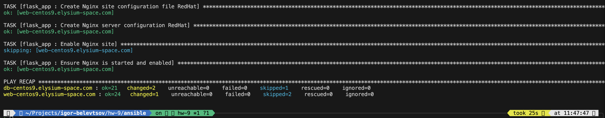
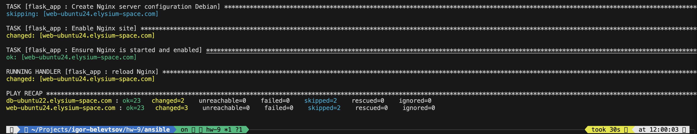
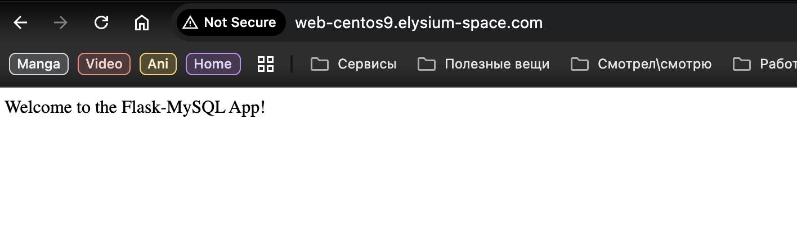
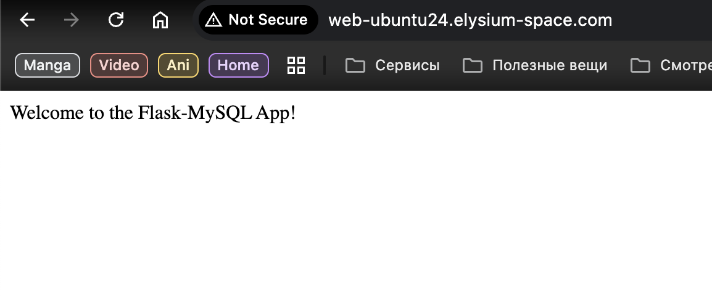
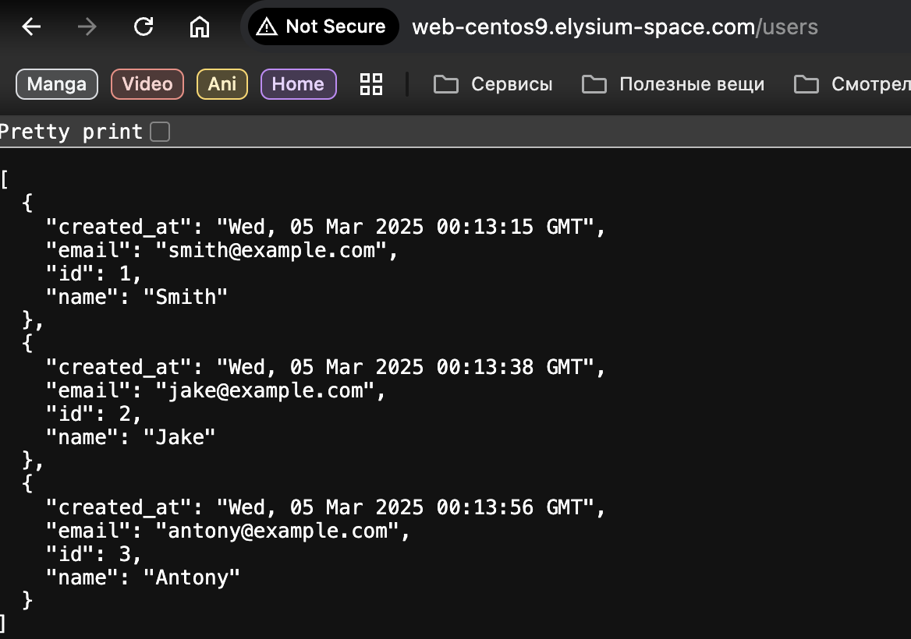
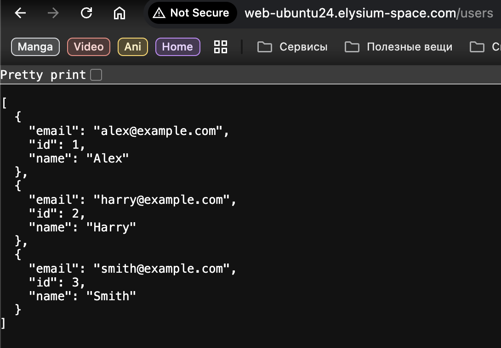

# HW-9 : Ansible roles

This guide will help you to deploy and configure web application that consist of frontend (Flask+Nginx) and backend (MySQL/MariaDB).

## Project Structure

```
./
├── ansible/                        # Ansible configuration directory
|    ├── roles/                     # Ansible roles location
|    |     ├── flask_app/           # Flask app configuration role
|    |     |       └── ...
|    |     ├── mariadb_setup/       # MariaDB configuration role
|    |     |       └── ...
|    |     ├── mysql_setup/         # MySQL configuration role | Under development, dont use it
|    |     |       └── ...
|    |     └── ssh_key_deployment   # SSH key deployment role
|    |             └── ...
|    ├── ansible.cfg                # MySQL database service manifest
|    ├── inventory.ini              # Project namespace manifest
|    └── playbook.yml               # Project secrets manifest
├── screenshots/                    # Screenshot location directory
└── README.md                       # This file
```

This Ansible project doing next 3 things:
- Deploying Ansible control plane host ssh keys to host deffined in invetory file.
- Installing and configuring MySQL/MariaDB database to use it with our application.
- Installing and configuring all prerequisites for Flask app.

Role specific README.md can be found in the each roles root directory.

Run project:
```bash
cd ansible/
ansible-playbook playbook.yml
```

<details>

**RedHat**


**Debian**

</details>

Check that Flask application and Nginx proxy works:

<details>

**RedHat**


**Debian**

</details>

Make some POST request to our application for database testing:

<details>

**RedHat**


**Debian**

</details>
